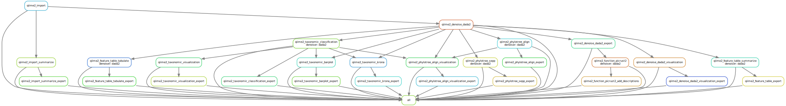

# Amplicon analysis pipeline

<div align=center></div>


## Installation

### Basic environment

```bash
➤ mkdir -p ~/.conda/envs
➤ wget https://github.com/conda-forge/miniforge/releases/latest/download/Mambaforge-Linux-x86_64.sh
➤ bash Mambaforge-Linux-x86_64.sh
# set the install path to ~/.conda/envs/mambaforge

# then activate mambaforge
➤ conda activate mambaforge

# install snakemake
➤ conda install -c bioconda -c conda-forge snakemake fd-find seqkit
```

### Set PYTHONPATH for ampi 

```bash
➤ echo "export PYTHONPATH=/path/to/ampi:$PYTHONPATH" >> ~/.bashrc
# relogin
```

## Overview

```bash
➤ conda activate mambaforge
➤ python /path/to/ampi/run_ampi.py --help

usage: ampi [-h] [-v]  ...

  ░█████╗░███╗░░░███╗██████╗░██╗
  ██╔══██╗████╗░████║██╔══██╗██║
  ███████║██╔████╔██║██████╔╝██║
  ██╔══██║██║╚██╔╝██║██╔═══╝░██║
  ██║░░██║██║░╚═╝░██║██║░░░░░██║
  ╚═╝░░╚═╝╚═╝░░░░░╚═╝╚═╝░░░░░╚═╝

Omics for All, Open Source for All

Amplicon sequence analysis pipeline

optional arguments:
  -h, --help     show this help message and exit
  -v, --version  print software version and exit

available subcommands:
  
    init         init project
    qiime2_wf    amplicon data analysis pipeline using QIIME2
```

## Real word

### Step_0: Activate conda environment

```bash
# for snakemake
➤ conda activate mambaforge
```

### Step_1: download test data

```bash
➤ mkdir -p test
➤ cd test
➤ wget -c https://mothur.s3.us-east-2.amazonaws.com/wiki/miseqsopdata.zip
➤ unzip miseqsopdata.zip
➤ gzip MiSeq_SOP/*.fastq
```

### Step 2: Samples sheet

```bash
➤ fd fastq.gz /full/path/to/MiSeq_SOP | \
  sort | uniq | paste - - | \
  awk -F'[/_]' \
  'BEGIN {print "sample-id\tforward-absolute-filepath\treverse-absolute-filepath"};{print $(NF-4) "\t" $0}' \
  > samples.tsv
```

### Step 3: Init

```bash
➤ cd test
➤ python /path/to/ampi/run_ampi.py init -d . -s samples.tsv

➤ ll
config.yaml
envs
profiles
results
samples.miseq_sop.tsv
```

### Step 4: update config.yaml

```bash
➤ cat config.yaml

params:
  samples: "samples.tsv"

  # https://docs.qiime2.org/2021.11/tutorials/importing/
  import:
    type: "SampleData[PairedEndSequencesWithQuality]"
    # EMPSingleEndSequences
    # EMPPairedEndSequences
    # MultiplexedSingleEndBarcodeInSequence
    # MultiplexedPairedEndBarcodeInSequence
    # SampleData[SequencesWithQuality]
    # SampleData[PairedEndSequencesWithQuality]
    # FeatureTable[Frequency]
    # Phylogeny[Unrooted]

    format: "PairedEndFastqManifestPhred33V2"
    # CasavaOneEightSingleLanePerSampleDirFmt
    # SingleEndFastqManifestPhred33V2
    # SingleEndFastqManifestPhred64V2
    # PairedEndFastqManifestPhred33V2
    # PairedEndFastqManifestPhred64V2
    # BIOMV100Format
    # BIOMV210Format


  denoise:
    threads: 8
    dada2:
      do: True
      paired:
        trunc_len_f: 280 # change to 240
        trunc_len_r: 250 # change to 160
        trim_left_f: 0
        trim_left_r: 0
      single:
        trunc_len: 120
        trim_left: 0
    deblur:
      do: False
      trim_len: 280
      left_trim_len: 0


  taxonomic:
    threads: 8
    classifier: /home/jiezhu/databases/ecogenomics/QIIME2/2022.11/taxonomic_classifier/silva-138-99-nb-classifier.qza
                # /home/jiezhu/databases/ecogenomics/QIIME2/2022.11/taxonomic_classifier/gg-13-8-99-515-806-nb-classifier.qza
                # /home/jiezhu/databases/ecogenomics/QIIME2/2022.11/taxonomic_classifier/gg-13-8-99-515-806-nb-weighted-classifier.qza
                # /home/jiezhu/databases/ecogenomics/QIIME2/2022.11/taxonomic_classifier/gg-13-8-99-nb-classifier.qza
                # /home/jiezhu/databases/ecogenomics/QIIME2/2022.11/taxonomic_classifier/gg-13-8-99-nb-weighted-classifier.qza
                # /home/jiezhu/databases/ecogenomics/QIIME2/2022.11/taxonomic_classifier/silva-138-99-515-806-nb-classifier.qza
                # /home/jiezhu/databases/ecogenomics/QIIME2/2022.11/taxonomic_classifier/silva-138-99-nb-classifier.qza
                # /home/jiezhu/databases/ecogenomics/QIIME2/2022.11/taxonomic_classifier/silva-138-99-nb-weighted-classifier.qza


output:
  tmp: "results/tmp"
  import: "results/00.import"
  denoise: "results/01.denoise"
  taxonomic: "results/03.taxonomic"


envs:
  qiime2: "envs/qiime2.yaml"
```

### Step 5: Dry run qiime2_wf

```bash
➤ python /path/to/ampi/run_ampi.py \
  qiime2_wf all --dry-run

Job stats:
job                                   count    min threads    max threads
----------------------------------  -------  -------------  -------------
all                                       1              1              1
qiime2_denoise_dada2                      1              1              1
qiime2_denoise_dada2_export               1              1              1
qiime2_denoise_dada2_visualization        1              1              1
qiime2_import                             1              1              1
qiime2_import_summarize                   1              1              1
qiime2_import_summarize_export            1              1              1
qiime2_taxonomic                          1              1              1
total                                     8              1              1
```

### Step 6: Wet run qiime2_wf

```bash
➤ python /path/to/ampi/run_ampi.py \
  qiime2_wf all \
  --use-conda \
  --run-local \
  --jobs 10 \
  --cores 10
```

### Step 7: Check results

```bash
➤ tree results

results/
├── 00.import
│   ├── demux.qza
│   ├── demux.qzv
│   ├── demux_qzv
│   │   ├── data.jsonp
│   │   ├── demultiplex-summary-forward.pdf
│   │   ├── demultiplex-summary-forward.png
│   │   ├── demultiplex-summary-reverse.pdf
│   │   ├── demultiplex-summary-reverse.png
│   │   ├── dist
│   │   │   ├── bundle.js
│   │   │   ├── d3-license.txt
│   │   │   └── vendor.bundle.js
│   │   ├── forward-seven-number-summaries.tsv
│   │   ├── index.html
│   │   ├── overview.html
│   │   ├── per-sample-fastq-counts.tsv
│   │   ├── q2templateassets
│   │   │   ├── css
│   │   │   │   ├── base-template.css
│   │   │   │   ├── bootstrap.min.css
│   │   │   │   ├── normalize.css
│   │   │   │   └── tab-parent.css
│   │   │   ├── fonts
│   │   │   │   ├── glyphicons-halflings-regular.eot
│   │   │   │   ├── glyphicons-halflings-regular.svg
│   │   │   │   ├── glyphicons-halflings-regular.ttf
│   │   │   │   ├── glyphicons-halflings-regular.woff
│   │   │   │   └── glyphicons-halflings-regular.woff2
│   │   │   ├── img
│   │   │   │   └── qiime2-rect-200.png
│   │   │   └── js
│   │   │       ├── bootstrap.min.js
│   │   │       ├── child.js
│   │   │       ├── jquery-3.2.0.min.js
│   │   │       └── parent.js
│   │   ├── quality-plot.html
│   │   └── reverse-seven-number-summaries.tsv
│   └── logs
│       └── qiime_import.log
├── 01.denoise
│   ├── dada2
│   │   ├── denoise_stats.qza
│   │   ├── denoise_stats_qza
│   │   │   └── stats.tsv
│   │   ├── denoise_stats.qzv
│   │   ├── rep_seqs.qza
│   │   ├── rep_seqs_qza
│   │   │   └── dna-sequences.fasta
│   │   ├── table.qza
│   │   └── table_qza
│   │       ├── feature-table.biom
│   │       └── feature-table.tsv
│   └── logs
│       └── denoise_dada2.log
│       └── taxonomic_dada2.log
└── 03.taxonomic
    ├── dada2
    │   └── taxonomy.qza
    └── logs
        └── taxonomic_dada2.log
```

## Note

### [Sequence phred quality score](https://en.wikipedia.org/wiki/FASTQ_format)

```bash
➤ seqkit convert xx.fq.gz | head
```

Phred Score table
| Quality system name | Phred Score  | Coordinates                   |
| :-----------------: | :----------: | :---------------------------: |
| S - Sanger          |   Phred+33   |  raw reads typically (0, 40)  |
| X - Solexa          |   Solexa+64  |  raw reads typically (-5, 40) |
| I - Illumina 1.3+   |   Phred+64   |  raw reads typically (0, 40)  |
| J - Illumina 1.5+   |   Phred+64   |  raw reads typically (3, 41)  |
| L - Illumina 1.8+   |   Phred+33   |  raw reads typically (0, 41)  |
| P - PacBio          |   Phred+33   |  HiFi reads typically (0, 93) |

### [QIIME2 taxonomy database Version 2022.11](https://docs.qiime2.org/2022.11/data-resources)

#### Taxonomy classifiers for use with q2-feature-classifier

- [Silva 138 99% OTUs full-length sequences](https://data.qiime2.org/2022.11/common/silva-138-99-nb-classifier.qza)
- [Silva 138 99% OTUs from 515F/806R region of sequences](https://data.qiime2.org/2022.11/common/silva-138-99-515-806-nb-classifier.qza)
- [Greengenes 13_8 99% OTUs full-length sequences](https://data.qiime2.org/2022.11/common/gg-13-8-99-nb-classifier.qza)
- [Greengenes 13_8 99% OTUs from 515F/806R region of sequences](https://data.qiime2.org/2022.11/common/gg-13-8-99-515-806-nb-classifier.qza)

#### Weighted Taxonomic Classifiers

- [Weighted Silva 138 99% OTUs full-length sequences](https://data.qiime2.org/2022.11/common/silva-138-99-nb-weighted-classifier.qza)
- [Weighted Greengenes 13_8 99% OTUs full-length sequences](https://data.qiime2.org/2022.11/common/gg-13-8-99-nb-weighted-classifier.qza)
- [Weighted Greengenes 13_8 99% OTUs from 515F/806R region of sequences](https://data.qiime2.org/2022.11/common/gg-13-8-99-515-806-nb-weighted-classifier.qza)
